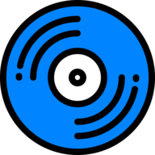

# Navidrome Music Server &nbsp;

Navidrome is an open source web-based music collection server and streamer. It gives you freedom to listen to your
music collection from any browser or mobile device. It's like your personal Spotify!

**Note**: The `master` branch may be in an unstable or even broken state during development. 
Please use [releases](https://github.com/navidrome/navidrome/releases) instead of 
the `master` branch in order to get a stable set of binaries.

## [Check out our Live Demo!](https://www.navidrome.org/demo/)

__Any feedback is welcome!__ If you need/want a new feature, find a bug or think of any way to improve Navidrome, 
please file a [GitHub issue](https://github.com/navidrome/navidrome/issues) or join the discussion in our 
[Subreddit](https://www.reddit.com/r/navidrome/). If you want to contribute to the project in any other way 
([ui/backend dev](https://www.navidrome.org/docs/developers/), 
[translations](https://www.navidrome.org/docs/developers/translations/), 
[themes](https://www.navidrome.org/docs/developers/creating-themes)), please join the chat in our 
[Discord server](https://discord.gg/xh7j7yF). 

## Installation

See instructions on the [project's website](https://www.navidrome.org/docs/installation/)

## Cloud Hosting

[PikaPods](https://www.pikapods.com) has partnered with us to offer you an 
[officially supported, cloud-hosted solution](https://www.navidrome.org/docs/installation/managed/#pikapods). 
A share of the revenue helps fund the development of Navidrome at no additional cost for you.

## Features
 
 - Handles very **large music collections**
 - Streams virtually **any audio format** available
 - Reads and uses all your beautifully curated **metadata**
 - Great support for **compilations** (Various Artists albums) and **box sets** (multi-disc albums)
 - **Multi-user**, each user has their own play counts, playlists, favourites, etc...
 - Very **low resource usage**
 - **Multi-platform**, runs on macOS, Linux and Windows. **Docker** images are also provided
 - Ready to use binaries for all major platforms, including **Raspberry Pi**
 - Automatically **monitors your library** for changes, importing new files and reloading new metadata 
 - **Themeable**, modern and responsive **Web interface** based on [Material UI](https://material-ui.com)
 - **Compatible** with all Subsonic/Madsonic/Airsonic [clients](https://www.navidrome.org/docs/overview/#apps)
 - **Transcoding** on the fly. Can be set per user/player. **Opus encoding is supported**
 - Translated to **various languages**

## Translations

Navidrome uses [POEditor](https://poeditor.com/) for translations, and we are always looking 
for [more contributors](https://www.navidrome.org/docs/developers/translations/)

## Documentation
All documentation can be found in the project's website: https://www.navidrome.org/docs. 
Here are some useful direct links:

- [Overview](https://www.navidrome.org/docs/overview/)
- [Installation](https://www.navidrome.org/docs/installation/)
  - [Docker](https://www.navidrome.org/docs/installation/docker/)
  - [Binaries](https://www.navidrome.org/docs/installation/pre-built-binaries/)
  - [Build from source](https://www.navidrome.org/docs/installation/build-from-source/)
- [Development](https://www.navidrome.org/docs/developers/)
- [Subsonic API Compatibility](https://www.navidrome.org/docs/developers/subsonic-api/)

## Screenshots

    
    
    
    

