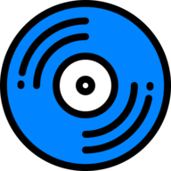

<a href="https://www.navidrome.org"></a>

# Navidrome Music Server &nbsp;[](https://twitter.com/intent/tweet?text=Tired%20of%20paying%20for%20music%20subscriptions%2C%20and%20not%20finding%20what%20you%20really%20like%3F%20Roll%20your%20own%20streaming%20service%21&url=https://navidrome.org&via=navidrome)

[](https://github.com/RFLundgren/navidrome_experimental/actions)
[](https://github.com/RFLundgren/navidrome_experimental/pkgs/container/navidrome_experimental)
[](https://discord.gg/xh7j7yF)
[](https://www.reddit.com/r/navidrome/)
[](CODE_OF_CONDUCT.md)

Navidrome is an open source web-based music collection server and streamer. It gives you freedom to listen to your
music collection from any browser or mobile device. It's like your personal Spotify!

## About This Fork

Navidrome is already the best self-hosted alternative to Spotify for your music library. **navidrome-experimental**
takes that same server and gives it a second life as a podcast platform too — full RSS subscriptions, streaming,
downloads, and retention, through the exact same Subsonic API you already use for your songs. No separate podcast
app, no separate sync, no separate account. It also adds physical folder browsing, for anyone who's spent years
organizing music by hand and doesn't want that structure hidden behind a metadata-only view.

Everything else works exactly like upstream Navidrome — same installation, same configuration, same Subsonic
compatibility, same plugin system. This fork just adds:

- 🎙️ **[Podcast support](PODCAST_PLAN.md)** — full RSS subscriptions, streamed or downloaded, through the real
  Subsonic API. See [below](#podcast-support-experimental) for the full feature list.
- 📁 **[Physical folder browsing](navidrome-folder-roadmap.md)** — navigate, play, and manage your library exactly
  as it's laid out on disk. See [below](#physical-folder-browsing-experimental) for the full feature list.

Kept in sync with upstream: currently based on [Navidrome v0.63.2](https://github.com/navidrome/navidrome/releases/tag/v0.63.2),
merged in directly rather than maintained as a standalone patch set. Syncs happen periodically, not on a fixed
schedule — check the [releases page](https://github.com/RFLundgren/navidrome_experimental/releases) for this fork's
own tagged checkpoints (e.g. `v0.63.2-experimental.3`), which pin the exact upstream baseline plus the fork-specific
fixes each one includes.

### Getting navidrome-experimental

This isn't in the official Navidrome image — you'll need to pull this fork's image specifically. Two tags are
published:

- `:stable` — the newest [tagged release](https://github.com/RFLundgren/navidrome_experimental/releases). Updated
  only when a new checkpoint is cut, not on every commit. **Recommended for most people.**
- `:develop` — tracks the tip of `master` directly. Gets fixes sooner, but may occasionally be in flux mid-fix.

Docker Compose, using the recommended `:stable` tag:

```yaml
services:
  navidrome:
    image: ghcr.io/rflundgren/navidrome_experimental:stable
    container_name: navidrome
    ports:
      - "4533:4533"
    restart: unless-stopped
    environment:
      ND_SCANSCHEDULE: 1h
      ND_LOGLEVEL: info
      ND_SESSIONTIMEOUT: 24h
    volumes:
      - "./data:/data"
      - "/path/to/your/music:/music:ro"
```

Already running stock Navidrome? Point your existing `docker-compose.yml` at
`ghcr.io/rflundgren/navidrome_experimental:stable` instead of the official image and keep your existing `/data`
volume — this fork tracks upstream closely and only *adds* tables/migrations, so your library and settings carry
over untouched; `docker compose pull && docker compose up -d` is all it takes.

For everything else — configuration options, reverse proxy setup, environment variables, building from source — the
[Documentation](#documentation) section below and [project's website](https://www.navidrome.org/docs/) apply exactly
as they do for upstream Navidrome.

**Note**: to pin an exact version rather than following whichever release is newest, use one of this fork's
[tagged releases](https://github.com/RFLundgren/navidrome_experimental/releases) directly (e.g.
`ghcr.io/rflundgren/navidrome_experimental:0.63.2-experimental.3`) instead of the `:stable` alias.

__Any feedback is welcome!__ Found a bug or have a feature idea specific to this fork's podcast/folder support?
File it on [this fork's issue tracker](https://github.com/RFLundgren/navidrome_experimental/issues) — please don't
report fork-specific issues upstream. For anything about Navidrome itself, the upstream project welcomes
[GitHub issues](https://github.com/navidrome/navidrome/issues) or discussion in their
[Subreddit](https://www.reddit.com/r/navidrome/). If you want to contribute to the upstream project in any other way 
([ui/backend dev](https://www.navidrome.org/docs/developers/), 
[translations](https://www.navidrome.org/docs/developers/translations/), 
[themes](https://www.navidrome.org/docs/developers/creating-themes)), please join the chat in their 
[Discord server](https://discord.gg/xh7j7yF). 

## Installation

For this fork specifically, see [Getting navidrome-experimental](#getting-navidrome-experimental) above. For
general installation concepts (reverse proxies, environment variables, building from source, etc.) that apply the
same way here as upstream, see instructions on the [project's website](https://www.navidrome.org/docs/installation/).

## Features
 
 - Handles very **large music collections**
 - Streams virtually **any audio format** available
 - Reads and uses all your beautifully curated **metadata**
 - Great support for **compilations** (Various Artists albums) and **box sets** (multi-disc albums)
 - **Multi-user**, each user has their own play counts, playlists, favourites, etc...
 - Very **low resource usage**
 - **Multi-platform**, runs on macOS, Linux and Windows. **Docker** images are also provided
 - Ready to use binaries for all major platforms, including **Raspberry Pi**
 - Automatically **monitors your library** for changes, importing new files and reloading new metadata 
 - Supports **lyrics** from sidecar .ttml, .yaml/.yml Lyricsfile, .elrc, .lrc, .srt, .txt files and embedded TTML, Enhanced LRC, LRC, SRT, and plain-text tags (via `lyricspriority`)
 - **Themeable**, modern and responsive **Web interface** based on [Material UI](https://material-ui.com)
 - **Compatible** with all Subsonic/Madsonic/Airsonic [clients](https://www.navidrome.org/docs/overview/#apps)
 - **Transcoding** on the fly. Can be set per user/player. **Opus encoding is supported**
 - Translated to **various languages**

## Podcast Support (Experimental)

Most self-hosted music servers treat podcasts as an afterthought, if they support them at all — usually meaning a
separate app, a separate sync, or no real download management. This fork builds podcasts as a first-class feature
on the same server, through the real Subsonic API spec's podcast endpoints — not a Navidrome-only extension. Any
client that has implemented that part of the spec gets full support with no server-specific hacks needed. Whether
your particular client shows a podcasts tab at all comes down to that client's own developers — spec coverage
varies a lot across the Subsonic app ecosystem, so check what your client actually supports before assuming.

### 🔍 Discover shows without hunting for RSS URLs
Search by name, or browse live, region-specific top charts to see what's actually trending where you are — pasting
in a feed URL directly still works too, if you already know exactly what you want.

### ▶️ Stream instantly, or keep it forever — your call, per show
Every subscription gets its own download policy: **stream-only** (nothing touches your disk — episodes proxy
through the server on demand, so any client can play them without ever knowing the source URL), **auto-download
new episodes** as they publish, or **backfill and download the entire back catalog**.

### 💾 Never worry about disk space
Set retention per channel by episode count, age, or total storage, and let oldest-downloaded-first cleanup run
automatically on the same schedule as feed refreshes. Add an episode to a playlist and it's automatically protected
from cleanup — retention will never quietly delete something you're actively queued up to listen to.

### 🎵 Episodes are real library citizens, not a bolted-on side feature
Downloaded episodes slot into regular playlists right alongside your music — reorder them, mix songs and episodes
in the same playlist, export it like any other. A checkmark shows which episodes you've already listened to,
tracked independently per user on multi-user servers.

### 🔌 Real Subsonic API coverage, not a partial implementation
`getPodcasts`, `getNewestPodcasts`, `createPodcastChannel`, `refreshPodcasts`, `deletePodcastChannel`/
`deletePodcastEpisode`, `downloadPodcastEpisode` are all real, spec-compliant endpoints — a client still needs its
own UI to call them (subscribing, browsing episodes, etc. are new surface area, not something existing song-browsing
screens do for free). Where it *does* piggyback on what's already there: once a client has an episode's ID,
streaming and downloading it go through the exact same `stream.view`/`download.view` endpoints it already uses for
songs — no separate playback path to build.

### 🎛️ Fine-grained control
Personal toggle to hide the Podcasts section from your own sidebar if you don't use it (same mechanism as the
Folder view toggle below) — and every setting above is per-channel, so a daily news show and a sprawling back
catalog can be managed completely differently on the same server.

Full design writeup, including what's still on the roadmap (resume playback position, a cross-channel "up next"
queue, OPML import/export), see [PODCAST_PLAN.md](PODCAST_PLAN.md).

## Physical Folder Browsing (Experimental)

If you've spent years curating a folder structure by hand — by label, by era, by mood, by whatever system makes
sense to you — metadata-only browsing throws all of that away. This fork adds a complete second way to navigate
your library: exactly as it sits on disk, breadcrumbs and all, with every action a metadata-based view gives you
plus a few it doesn't.

### 🗂️ Browse it exactly how you built it
Hierarchical navigation with working breadcrumbs at every depth, tested past 500+ items per level. Folders get the
same visual treatment as albums — thumbnails (automatically composited from the first four albums found inside, so
even a folder full of subfolders looks right), a Grid/List view toggle, and empty sections hidden automatically
rather than cluttering the view.

### ⚡ Act on a whole folder tree at once
Play All, Shuffle, or Add to Playlist for an entire folder hierarchy — subfolders included — in a single click. No
more selecting every track by hand when you just want to queue up an entire artist's directory or a whole era of
your collection.

### 📊 Know what's actually in a folder before you open it
Every folder shows its subfolder count, song count, total physical disk size, and total play time right in the
list — at a glance, without drilling in.

### 📦 Take it with you
Download an entire physical folder as a ZIP archive directly from the toolbar, generated on-the-fly from your
existing library — perfect for backups or handing a chunk of your collection to someone else.

### 🔎 Search that stays where you are
A scoped search bar inside any folder view filters to just that folder and its children — find a specific track or
subfolder without losing your place in a large hierarchy.

### 📌 Folders that stay in sync, automatically
"Pin" any physical folder as a Navidrome playlist, and it updates itself as files are added to or removed from that
folder on disk during the next library scan. Set it up once and it stays accurate forever — no manual re-adding.

### 🧭 Jump straight to where a file lives
A "Show in Folder" action on any song or album jumps you directly to its exact physical location — useful for
tracking down duplicates, checking tag consistency, or just satisfying curiosity about where something actually
lives.

### 🔌 Works beyond the web UI too
Compatible with Subsonic clients that support physical folder browsing, so this isn't a web-only feature.

For the full history of what's shipped and what's planned, see
[navidrome-folder-roadmap.md](navidrome-folder-roadmap.md).

## Translations

Navidrome uses [POEditor](https://poeditor.com/) for translations, and we are always looking 
for [more contributors](https://www.navidrome.org/docs/developers/translations/)

<a href="https://poeditor.com/"> 

</a>

## Documentation
All documentation can be found in the project's website: https://www.navidrome.org/docs. 
Here are some useful direct links:

- [Overview](https://www.navidrome.org/docs/overview/)
- [Installation](https://www.navidrome.org/docs/installation/)
  - [Docker](https://www.navidrome.org/docs/installation/docker/)
  - [Binaries](https://www.navidrome.org/docs/installation/pre-built-binaries/)
  - [Build from source](https://www.navidrome.org/docs/installation/build-from-source/)
- [Development](https://www.navidrome.org/docs/developers/)
- [Subsonic API Compatibility](https://www.navidrome.org/docs/developers/subsonic-api/)

## Screenshots

<p align="left">
    
    
    
    
</p>
