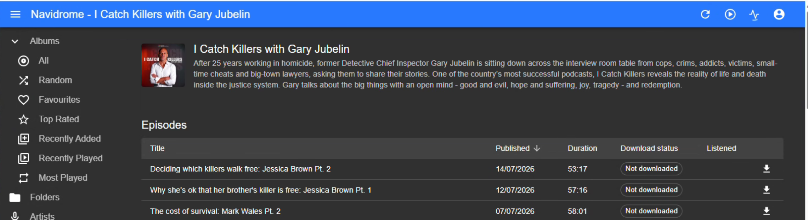
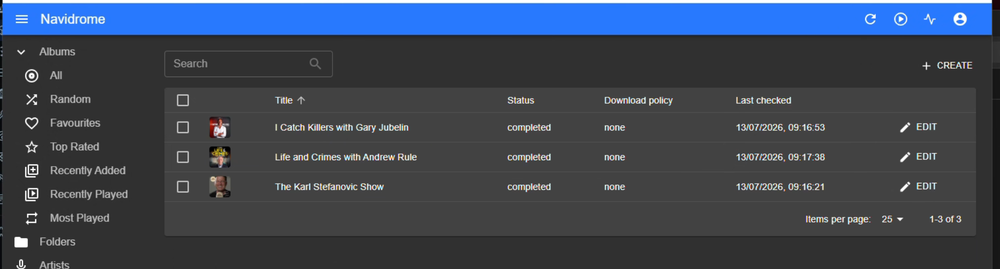
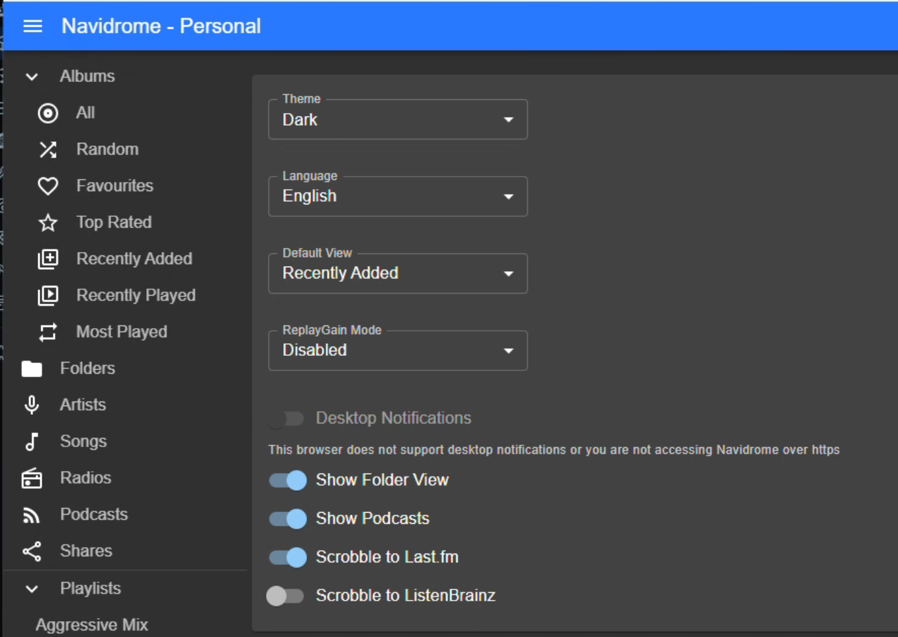
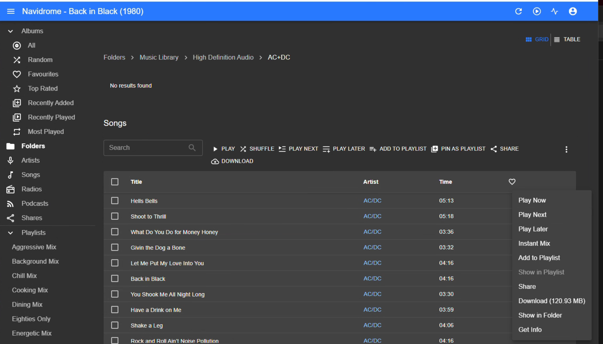
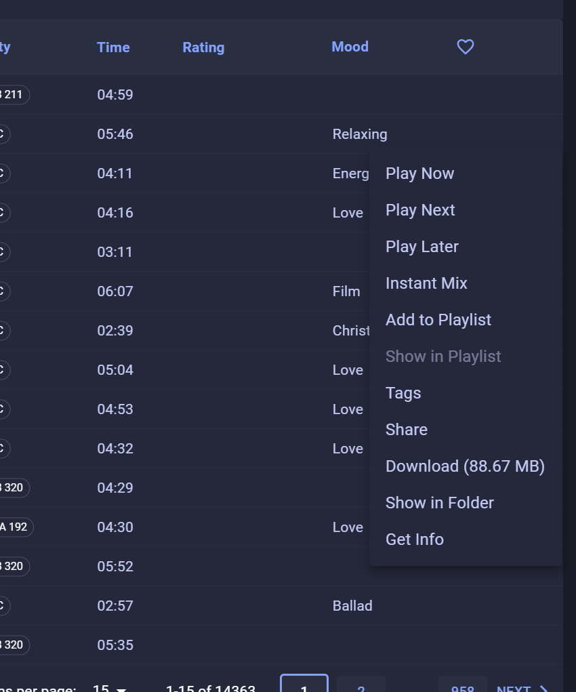
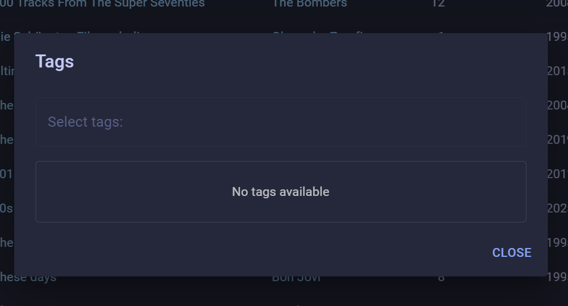
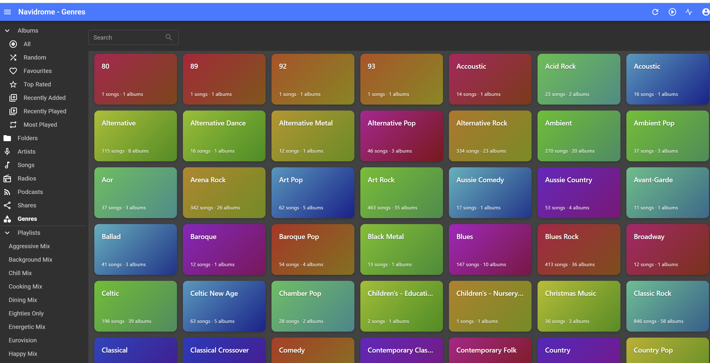
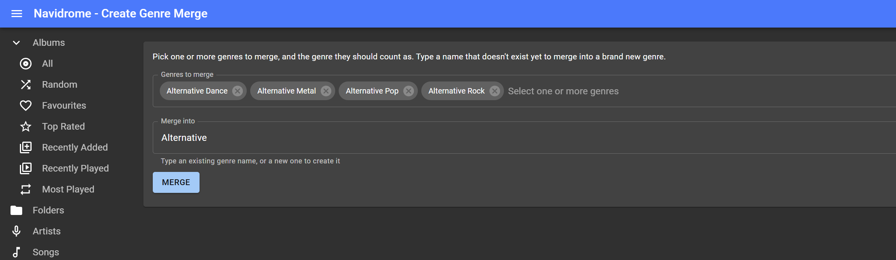

<a href="https://www.navidrome.org"></a>

# Navidrome Music Server &nbsp;[](https://twitter.com/intent/tweet?text=Tired%20of%20paying%20for%20music%20subscriptions%2C%20and%20not%20finding%20what%20you%20really%20like%3F%20Roll%20your%20own%20streaming%20service%21&url=https://navidrome.org&via=navidrome)

[](https://github.com/RFLundgren/navidrome_experimental/actions)
[](https://github.com/RFLundgren/navidrome_experimental/pkgs/container/navidrome_experimental)
[](https://discord.gg/xh7j7yF)
[](https://www.reddit.com/r/navidrome/)
[](CODE_OF_CONDUCT.md)

Navidrome is an open source web-based music collection server and streamer. It gives you freedom to listen to your
music collection from any browser or mobile device. It's like your personal Spotify!

## About This Fork

Navidrome is already the best self-hosted alternative to Spotify for your music library. **navidrome-experimental**
takes that same server and gives it a second life as a podcast platform too — full RSS subscriptions, streaming,
downloads, and retention, through the exact same Subsonic API you already use for your songs. No separate podcast
app, no separate sync, no separate account. It also adds physical folder browsing, for anyone who's spent years
organizing music by hand and doesn't want that structure hidden behind a metadata-only view.

Everything else works exactly like upstream Navidrome — same installation, same configuration, same Subsonic
compatibility, same plugin system. This fork just adds:

- 🎙️ **[Podcast support](PODCAST_PLAN.md)** *(stable & develop)* — full RSS subscriptions, streamed or downloaded,
  through the real Subsonic API. Any user can subscribe, on a shared feed fetched once no matter how many
  subscribers it has. See [below](#podcast-support-experimental) for the full feature list.
- 📁 **[Physical folder browsing](navidrome-folder-roadmap.md)** *(stable & develop)* — navigate, play, and manage
  your library exactly as it's laid out on disk. See [below](#physical-folder-browsing-experimental) for the full
  feature list.
- 📡 **Enhanced scrobble attribution** *(stable & develop)* — richer client/source/playback-mode context on every
  scrobble, available to plugins too. See [below](#enhanced-scrobble-attribution-pulse-integration) for details.
- 🎙️📡 **Podcast play attribution** *(develop only)* — podcast episode plays now dispatch to plugins too, with a
  validated `nd_source` device-type field for precise client identification. See
  [below](#enhanced-scrobble-attribution-pulse-integration) for details.
- 🏷️ **User-defined song tagging** *(develop only)* — free-form personal labels (**My Tags**) plus shared,
  admin-written classification tags (**AI Tags**), with tag-based filtering, bulk playlist add, smart-playlist
  criteria support, and a plugin-facing API powering an AI auto-tagging + auto-playlist ecosystem. See
  [below](#user-defined-song-tagging-experimental) for details.
- 🏷️ **AI Genre / AI Mood / My Tags dashboards** *(develop only)* — three chip-grid browsing pages built from your
  tags, each independently toggleable from Settings → Personal. See
  [below](#ai-genre--ai-mood--my-tags-dashboards-experimental) for details.
- 🔘 **On-demand plugin actions** *(develop only)* — a "Test Connection"-style button any plugin can add to its own
  config page, for things that need a one-off run rather than a schedule (e.g. validating an AI provider's API key
  before a real scan). See [below](#on-demand-plugin-actions-experimental) for details.
- ⏭️ **Skip / auto-pass disliked songs** *(develop only)* — flag a song as skipped and the player automatically
  passes over it during playback, without deleting it. See
  [below](#skip--auto-pass-disliked-songs-experimental) for details.
- 🎼 **Genre exploration** *(develop only)* — a real sidebar entry for browsing by genre, with a colored dashboard,
  albums, top songs, and one-click deduplicated playlist creation. See
  [below](#genre-exploration-experimental) for details.
- 🔗 **Genre merging** *(develop only)* — collapse near-duplicate genres from inconsistent tagging into one, applied
  at scan time so every Subsonic client and smart playlist sees the merge too, not just this web UI. See
  [below](#genre-merging-experimental) for details.
- 🔐 **Admin-controlled feature access** *(develop only)* — an admin can revoke any individual user's access to
  Folders, AI Tags, My Tags, or Podcasts, per user, without affecting anyone else. See
  [below](#admin-controlled-feature-access-experimental) for details.

*(develop only)* features haven't reached a tagged `:stable` checkpoint yet — see
[Getting navidrome-experimental](#getting-navidrome-experimental) below for what the two tags mean. They'll move to
*(stable & develop)* the next time a release is cut.

Kept in sync with upstream: currently based on [Navidrome v0.63.2](https://github.com/navidrome/navidrome/releases/tag/v0.63.2),
merged in directly rather than maintained as a standalone patch set. Syncs happen periodically, not on a fixed
schedule — check the [releases page](https://github.com/RFLundgren/navidrome_experimental/releases) for this fork's
own tagged checkpoints (e.g. `v0.63.2-experimental.3`), which pin the exact upstream baseline plus the fork-specific
fixes each one includes.

### Getting navidrome-experimental

This isn't in the official Navidrome image — you'll need to pull this fork's image specifically. Two tags are
published:

- `:stable` — the newest [tagged release](https://github.com/RFLundgren/navidrome_experimental/releases). Updated
  only when a new checkpoint is cut, not on every commit. **Recommended for most people.**
- `:develop` — tracks the tip of `master` directly. Gets fixes sooner, but may occasionally be in flux mid-fix.

Docker Compose, using the recommended `:stable` tag:

```yaml
services:
  navidrome:
    image: ghcr.io/rflundgren/navidrome_experimental:stable
    container_name: navidrome
    ports:
      - "4533:4533"
    restart: unless-stopped
    environment:
      ND_SCANSCHEDULE: 1h
      ND_LOGLEVEL: info
      ND_SESSIONTIMEOUT: 24h
    volumes:
      - "./data:/data"
      - "/path/to/your/music:/music:ro"
```

Already running stock Navidrome? Point your existing `docker-compose.yml` at
`ghcr.io/rflundgren/navidrome_experimental:stable` instead of the official image and keep your existing `/data`
volume — this fork tracks upstream closely and only *adds* tables/migrations, so your library and settings carry
over untouched; `docker compose pull && docker compose up -d` is all it takes.

For everything else — configuration options, reverse proxy setup, environment variables, building from source — the
[Documentation](#documentation) section below and [project's website](https://www.navidrome.org/docs/) apply exactly
as they do for upstream Navidrome.

__Any feedback is welcome!__ Found a bug or have a feature idea specific to this fork's podcast/folder support?
File it on [this fork's issue tracker](https://github.com/RFLundgren/navidrome_experimental/issues) — please don't
report fork-specific issues upstream. For anything about Navidrome itself, the upstream project welcomes
[GitHub issues](https://github.com/navidrome/navidrome/issues) or discussion in their
[Subreddit](https://www.reddit.com/r/navidrome/). If you want to contribute to the upstream project in any other way 
([ui/backend dev](https://www.navidrome.org/docs/developers/), 
[translations](https://www.navidrome.org/docs/developers/translations/), 
[themes](https://www.navidrome.org/docs/developers/creating-themes)), please join the chat in their 
[Discord server](https://discord.gg/xh7j7yF). 

## Installation

For this fork specifically, see [Getting navidrome-experimental](#getting-navidrome-experimental) above. For
general installation concepts (reverse proxies, environment variables, building from source, etc.) that apply the
same way here as upstream, see instructions on the [project's website](https://www.navidrome.org/docs/installation/).

## Features
 
 - Handles very **large music collections**
 - Streams virtually **any audio format** available
 - Reads and uses all your beautifully curated **metadata**
 - Great support for **compilations** (Various Artists albums) and **box sets** (multi-disc albums)
 - **Multi-user**, each user has their own play counts, playlists, favourites, etc...
 - Very **low resource usage**
 - **Multi-platform**, runs on macOS, Linux and Windows. **Docker** images are also provided
 - Ready to use binaries for all major platforms, including **Raspberry Pi**
 - Automatically **monitors your library** for changes, importing new files and reloading new metadata 
 - Supports **lyrics** from sidecar .ttml, .yaml/.yml Lyricsfile, .elrc, .lrc, .srt, .txt files and embedded TTML, Enhanced LRC, LRC, SRT, and plain-text tags (via `lyricspriority`)
 - **Themeable**, modern and responsive **Web interface** based on [Material UI](https://material-ui.com)
 - **Compatible** with all Subsonic/Madsonic/Airsonic [clients](https://www.navidrome.org/docs/overview/#apps)
 - **Transcoding** on the fly. Can be set per user/player. **Opus encoding is supported**
 - Translated to **various languages**

## Podcast Support (Experimental)

Most self-hosted music servers treat podcasts as an afterthought, if they support them at all — usually meaning a
separate app, a separate sync, or no real download management. This fork builds podcasts as a first-class feature
on the same server, through the real Subsonic API spec's podcast endpoints — not a Navidrome-only extension. Any
client that has implemented that part of the spec gets full support with no server-specific hacks needed. Whether
your particular client shows a podcasts tab at all comes down to that client's own developers — spec coverage
varies a lot across the Subsonic app ecosystem, so check what your client actually supports before assuming.

<p align="left">
    
</p>

### 🔍 Discover shows without hunting for RSS URLs
Search by name, or browse live, region-specific top charts to see what's actually trending where you are — pasting
in a feed URL directly still works too, if you already know exactly what you want.

### ▶️ Stream instantly, or keep it forever — your call, per show
Every subscription gets its own download policy: **stream-only** (nothing touches your disk — episodes proxy
through the server on demand, so any client can play them without ever knowing the source URL), **auto-download
new episodes** as they publish, or **backfill and download the entire back catalog**.

<p align="left">
    
</p>

### 👥 Subscribe to any show — the feed itself is shared, your list isn't
Any user can subscribe to a podcast, not just admins. The underlying feed is shared infrastructure — a show is only
ever fetched and refreshed once no matter how many people on your server subscribe to it — but everything else is
personal: your own download policy, your own retention limits, and your own "downloaded" list. If another
subscriber already downloaded an episode, your download click resolves instantly from that existing file instead
of fetching it again, and it only shows up in *your* list once you actually ask for it — subscribing to a channel
someone else already downloaded episodes for doesn't silently dump their whole back catalog into your own list.
Unsubscribing removes just your own subscription; the shared feed and its files stick around as long as anyone
else is still subscribed, and clean up automatically once the last subscriber leaves.

### ⏰ Automatic refresh isn't on by default — you turn it on
Checking subscribed feeds for new episodes runs on a schedule you configure, not automatically out of the box. Set
`ND_PODCASTS_SCHEDULE` (or `Podcasts.Schedule` in a config file) to a cron expression or an `@every` duration — same
syntax and format as `ND_SCANSCHEDULE` (e.g. `@every 1h`). Leave it unset (or `"0"`) and periodic checking stays off
— a brand-new subscription still gets one immediate refresh the moment you add it, but nothing checks for new
episodes on existing subscriptions after that until you set this. Retention cleanup (below) rides along on this same
schedule, so it's worth setting even if picking up new episodes quickly isn't a priority for you.

### 💾 Never worry about disk space
Set retention per subscription — yours, specifically — by episode count, age, or total storage, and let
oldest-downloaded-first cleanup run automatically on the same schedule as feed refreshes. Because retention is
per-subscriber, two different people subscribed to the same show can keep completely different amounts of it
downloaded. A file is only actually deleted from disk once no subscriber anywhere still wants it — clearing your
own retention limit never yanks an episode out from under someone else who's still keeping it. Add an episode to a
playlist and it's automatically protected from cleanup — retention will never quietly delete something you're
actively queued up to listen to.

### 🎵 Episodes are real library citizens, not a bolted-on side feature
Downloaded episodes slot into regular playlists right alongside your music — reorder them, mix songs and episodes
in the same playlist, export it like any other. A checkmark shows which episodes you've already listened to,
tracked independently per user on multi-user servers — click it to mark (or unmark) an episode as listened
yourself, for whenever you downloaded it and listened somewhere else entirely.

### 🔌 Real Subsonic API coverage, not a partial implementation
`getPodcasts`, `getNewestPodcasts`, `createPodcastChannel`, `refreshPodcasts`, `deletePodcastChannel`/
`deletePodcastEpisode`, `downloadPodcastEpisode`, `markPodcastEpisodeListened`/`markPodcastEpisodeUnlistened` are
all real, spec-compliant endpoints — a client still needs its own UI to call them (subscribing, browsing episodes,
etc. are new surface area, not something existing song-browsing screens do for free). Where it *does* piggyback on
what's already there: once a client has an episode's ID, streaming and downloading it go through the exact same
`stream.view`/`download.view` endpoints it already uses for
songs — no separate playback path to build.

### 🎛️ Fine-grained control
Personal toggle to hide the Podcasts section from your own sidebar if you don't use it (same mechanism as the
Folder view toggle below) — and every download/retention setting above is per-subscription, so a daily news show
and a sprawling back catalog can be managed completely differently, even by two different people subscribed to the
exact same feed on the same server. An admin can also revoke a specific user's access to Podcasts entirely — see
[Admin-Controlled Feature Access](#admin-controlled-feature-access-experimental) below.

<p align="left">
    
</p>

Full design writeup, including what's still on the roadmap (resume playback position, a cross-channel "up next"
queue, OPML import/export), see [PODCAST_PLAN.md](PODCAST_PLAN.md).

## Physical Folder Browsing (Experimental)

If you've spent years curating a folder structure by hand — by label, by era, by mood, by whatever system makes
sense to you — metadata-only browsing throws all of that away. This fork adds a complete second way to navigate
your library: exactly as it sits on disk, breadcrumbs and all, with every action a metadata-based view gives you
plus a few it doesn't.

<p align="left">
    
</p>

### 🗂️ Browse it exactly how you built it
Hierarchical navigation with working breadcrumbs at every depth, tested past 500+ items per level. Folders get the
same visual treatment as albums — thumbnails (automatically composited from the first four albums found inside, so
even a folder full of subfolders looks right), a Grid/List view toggle, and empty sections hidden automatically
rather than cluttering the view.

### ⚡ Act on a whole folder tree at once
Play All, Shuffle, or Add to Playlist for an entire folder hierarchy — subfolders included — in a single click. No
more selecting every track by hand when you just want to queue up an entire artist's directory or a whole era of
your collection.

### 📊 Know what's actually in a folder before you open it
Every folder shows its subfolder count, song count, total physical disk size, and total play time right in the
list — at a glance, without drilling in.

### 📦 Take it with you
Download an entire physical folder as a ZIP archive directly from the toolbar, generated on-the-fly from your
existing library — perfect for backups or handing a chunk of your collection to someone else.

### 🔎 Search that stays where you are
A scoped search bar inside any folder view filters to just that folder and its children — find a specific track or
subfolder without losing your place in a large hierarchy.

### 📌 Folders that stay in sync, automatically
"Pin" any physical folder as a Navidrome playlist, and it updates itself as files are added to or removed from that
folder on disk during the next library scan. Set it up once and it stays accurate forever — no manual re-adding.

### 🧭 Jump straight to where a file lives
A "Show in Folder" action on any song or album jumps you directly to its exact physical location — useful for
tracking down duplicates, checking tag consistency, or just satisfying curiosity about where something actually
lives.

### 🔌 Works beyond the web UI too
Compatible with Subsonic clients that support physical folder browsing, so this isn't a web-only feature.

For the full history of what's shipped and what's planned, see
[navidrome-folder-roadmap.md](navidrome-folder-roadmap.md).

## User-Defined Song Tagging (Experimental)

Genre, mood, and grouping tags come from your files' embedded metadata — useful, but fixed, and shared across
everyone on the server. This fork adds a second kind of tag: ones stored per-user, entirely separate from file
metadata, and private to your own account even when other people share the same library. There are two distinct
sources of these tags, kept deliberately separate so they never get mixed up: **My Tags**, which you create by
hand, and **AI Tags**, which the companion [AI Auto-Tagging](https://github.com/RFLundgren/AI-auto-tagging-plugin)
plugin writes automatically. Both live in the same underlying storage, but each has its own column in the Songs
list, and only My Tags are editable from the song context menu.

<p align="left">
    
</p>

### 🏷️ My Tags: tag anything, however you want
Apply your own free-form labels to any song from its context menu ("Edit Tags") — "workout," "background music for
writing," whatever makes sense to you. A tag doesn't need to be created ahead of time; typing a new name and
applying it is enough, and it becomes a reusable option for every other song from that point on.

<p align="left">
    
</p>

**This dialog only shows and edits My Tags — AI Tags never appear here, and can't be toggled on/off per-track from
this UI.** If a song already has AI-written tags, opening "Edit Tags" on it won't show them; you'll only see (and
be able to add to) your own hand-added tags. That's intentional, not a bug: AI Tags are meant to be managed
entirely by the plugin's own classification runs, not spot-edited per song — see the next section.

### 🤖 AI Tags: written automatically by a plugin, not edited by hand
If you've installed [AI Auto-Tagging](https://github.com/RFLundgren/AI-auto-tagging-plugin) on an admin account,
it classifies tracks by genre/mood/language using an AI provider and writes the results here, shared for every
user who has AI Tags visibility. These show up in their own **AI Tags** column in the Songs list (a separate
column from **My Tags** — both are off by default; turn them on via the column-visibility menu in the Songs list
toolbar). To change *which words* the AI is allowed to use (e.g. add
"trance" to the genre list, or remove moods you don't care about), edit that plugin's **Genre Vocabulary**/**Mood
Vocabulary** config fields — not anything in this UI. There is currently no button in this UI to manually add or
remove an individual AI Tag on a song; that's a deliberate scope boundary, not a missing feature — AI Tags are
meant to reflect what the classifier actually decided, not be hand-edited afterward. If you disagree with a
specific AI-assigned tag, the supported path is a **My Tag** of your own alongside it, not editing the AI Tag
itself.

### 🔒 My Tags stay private — AI Tags are shared library data
My Tags are scoped entirely to your own account: two people tagging songs on the same shared library never see
each other's My Tags, and there's no admin-managed or global My Tags list to work around. AI Tags work
differently, by design — a tag written by *any* admin account's AI Auto-Tagging run is shared library data,
visible to every user who has access to it, the same way genre/mood metadata from your files already is. This
means one admin sets up and runs AI Auto-Tagging once for the whole server, instead of every individual user
needing their own separate classification pass over the same library. Whether a given user can see AI Tags at all
(and independently, whether they can see My Tags, Folders, or Podcasts) is controlled per-user by an admin — see
[Admin-Controlled Feature Access](#admin-controlled-feature-access-experimental) below.

### 🎯 Filter and bulk-add in one action
A "Tag" filter on the song list narrows to everything carrying a given tag name (matching either My Tags or AI
Tags — it's not source-specific), and the "Bind by Tag" button adds every matching song to a playlist in one
click — no selecting songs one at a time.

### 🔁 Smart playlists that follow your tags automatically
Tags are usable as smart-playlist (`.nsp`) criteria via the `usertag` field, so a playlist can auto-update as tags
change, instead of needing to be rebuilt by hand every time something does. This criteria field also matches either
source, same as the filter above — if you specifically want playlists built per AI-discovered genre/mood value
with per-artist diversity capping (which a `.nsp` smart playlist criteria field alone can't express), see
[AI Mood Playlists](https://github.com/RFLundgren/AI-Mood-Playlists-Plugin) instead.

### 🔌 A plugin-facing API, with source built in
The tagging system is exposed to plugins through five Subsonic-tier endpoints. `setUserTag.view` (write),
`getUserTags.view` (read one song's tags), `getAllUserTags.view` (discover every tag value in use), and
`getSongsByUserTag.view` (find every song carrying a given value) are **AI-only** — they always write/read
`source=ai`, so a plugin using this API never sees or accidentally interferes with a person's hand-added tags, and
a person's My Tags can never make AI Auto-Tagging's "already classified this track" check wrongly skip it.
`removeUserTag.view` removes by (song, tag name) regardless of source. There's also a native REST API
(`/mediaFileTag`, used by the "Edit Tags" dialog above) for the human-facing side: its `POST`/`DELETE` always
write/remove `source=user`, and its `GET` endpoints accept an optional `?source=ai` or `?source=user` query
parameter to narrow results (omit it to get both, which is what the smart-playlist criteria and list filter do).

For a Subsonic client (Cirque, for example) that wants to read a person's own My Tags specifically — not the
native REST API, and not mixed in with AI Tags — two read-only endpoints mirror the AI-only family exactly, but
scoped to `source=user`: `getAllMyTags.view` (every My Tag name in use) and `getSongsByMyTag.view` (every song
carrying a given My Tag). These are strictly additive: the `*UserTag` family above is untouched and stays
AI-only, so the AI Auto-Tagging plugin's behavior never changes. There's currently no `setMyTag.view`/
`removeMyTag.view` — writing a My Tag from a client is native-REST-only for now, same as the "Edit Tags" dialog
uses.

This API is what powers two companion projects, both outside this repo:
[AI Auto-Tagging](https://github.com/RFLundgren/AI-auto-tagging-plugin), which classifies tracks by genre/mood/
language using an AI provider and writes the results as tags, and
[AI Mood Playlists](https://github.com/RFLundgren/AI-Mood-Playlists-Plugin), which builds and maintains a playlist
per discovered AI Tag value from those classifications.

Requested in [navidrome/navidrome discussion #4823](https://github.com/navidrome/navidrome/discussions/4823).

## AI Genre / AI Mood / My Tags Dashboards (Experimental)

Three new sidebar entries — **AI Genre**, **AI Mood**, and **My Tags** — each a chip-grid dashboard in the same
visual style as the existing Genre Exploration page, but built from your tags instead of embedded file metadata.
Click a chip to land on that value's own page: every song carrying it, plus a "Create Playlist" action.

<p align="left">
    
</p>

### 🏷️ Three separate views, split by tag source and category
AI Auto-Tagging's `genre:`/`mood:` tags and a person's own hand-added tags are already kept apart at the storage
level (see **AI Tags vs. My Tags** above) — these dashboards just give each its own browsable page instead of only
being visible as a column in the Songs list. AI Genre and AI Mood split AI Auto-Tagging's combined tag namespace
by its `genre:`/`mood:` prefix into two separate chip grids; My Tags shows whatever personal tags exist, with no
such split since personal tags aren't categorized.

### 🎯 A song list and a playlist action, not a full genre-style layout
Unlike Genre's page (which also shows Albums, since genre is a per-album concept), a tag's landing page is just
the matching songs plus **Shuffle** and **Create Playlist** — tags are per-song, so an album can easily have some
songs carrying a tag and others not, and there's no honest "this album belongs to this tag" the way there is for
genre. Create Playlist here has the exact same **exclude skipped**/**exclude duplicates**/**max tracks per artist**
options as Genre's own dialog (see [Genre Exploration](#genre-exploration-experimental) below).

### 📄 Paginated and searchable, same as Genre's song lists
The song list on a tag's page has real pagination and its own artist/song search box too — the same fix applied to
Genre's Top Songs/Recently Added sections below.

<p align="left">
    
</p>

### 🔘 Each one toggleable independently, including the standard Genre view
All three new dashboards, plus the pre-existing standard Genre view, now have their own show/hide switch under
Settings → Personal. All four default to visible — existing users see no change unless they actively hide one.

<p align="left">
    
</p>

## On-Demand Plugin Actions (Experimental)

Navidrome's plugin config page previously had only one way to interact with a plugin: edit its config fields and
hit Save. There was no way for a plugin to expose a one-off "do something now" action — useful for things you
want to trigger deliberately rather than wait for a schedule, like validating an API key before committing to a
real run.

### 🔘 A button, not just a form
Any plugin can declare one or more named actions in its `manifest.json` (a `name`, a button `label`, and an
optional `description`). Each declared action shows up as its own button in an **Actions** section on that
plugin's config page — no core Navidrome code changes needed per plugin, the button and its label are entirely
driven by what the plugin declares.

### ✅ Immediate result, right there in the UI
Clicking the button calls the plugin synchronously and shows what it returned directly under the button — a
success message, or the plugin's own error text if something went wrong (e.g. an invalid API key). No need to dig
through server logs to find out whether it worked.

### 🤖 First real use: AI Auto-Tagging's "Test Model" button
[AI Auto-Tagging](https://github.com/RFLundgren/AI-auto-tagging-plugin) uses this to add a **Test Model** button
to its own config page — it sends one small request to your configured AI provider/model/API key, without
touching your library or writing any tags, so you can confirm your settings actually work before kicking off a
real scan across potentially thousands of tracks (and real provider cost). See that plugin's README for what the
button does and what the result messages mean.

### 🔌 For plugin developers
Implementing an action requires the plugin to export the new action capability's `nd_on_action` function
(`github.com/navidrome/navidrome/plugins/pdk/go/action` for Go plugins - register it alongside your other
capabilities, then dispatch on `ActionRequest.Name` in your handler) and declare the same action name(s) in
`manifest.json`'s `actions` array. The plugin must also be enabled/loaded for its actions to run - like config
changes, an action call goes to the currently loaded instance.

## Skip / Auto-Pass Disliked Songs (Experimental)

Some songs in your library you never want to hear again, but don't want to delete or maintain a separate exclusion
playlist for. This fork lets you flag a song as skipped, and the player automatically passes over it whenever it
comes up next — during shuffle, a playlist, an album, anywhere.

### ⏭️ Flag it once, skip it everywhere
Mark a song as skipped from its context menu. Nothing is deleted or hidden — the song stays exactly where it is in
your library, the player just automatically advances past it during playback.

### 🔁 Takes effect immediately, even mid-session
Flagging a song already sitting in your current queue skips it right away, not just for songs added afterward.

### 👀 Still visible, just dimmed
Skipped songs stay in the song list (dimmed, not hidden) and remain fully playable with an explicit click — the
auto-skip only kicks in during normal advance/auto-play.

Requested in [navidrome/navidrome discussion #3899](https://github.com/navidrome/navidrome/discussions/3899).

## Enhanced Scrobble Attribution (Pulse Integration)

Beyond just recording that a song was played, this fork adds richer context about *how* and *where* it was played
to the scrobbling pipeline.

### 📡 Client, source, and playback-mode context
Every scrobble/play report can now carry `client`, `source`, `origin`, and `playback_mode` fields (e.g.
distinguishing "Android Auto" from "Web" from "Windows Desktop"), stored alongside the play itself.

### 🔌 Available to plugins too
The Plugin API's `ScrobbleRequest`/`NowPlayingRequest` types carry the same attribution fields, so a companion
plugin (built for this fork's own Pulse project) can build listening stats like "you mostly listen via your
Favorites mix" without needing a separate external bridge process.

### 📱 `nd_source`: precise Cirque client identification *(develop only)*
`source` above is a free-form field. `nd_source` is a stricter companion specifically for identifying which Cirque
client variant sent the request — validated against a fixed allowlist (`android_phone`, `android_tablet`,
`android_tv`, `android_auto`, `windows_desktop`); anything else is silently ignored rather than rejecting the
request, so standard Subsonic clients that never send it are completely unaffected. It's read on both
`scrobble.view` and podcast episode streaming.

### 🎙️ Podcast plays get the same treatment *(develop only)*
Podcast episode plays now dispatch to plugins too, through a new `PodcastScrobbler` capability
(`OnPodcastPlayed`/`PodcastPlayedRequest`, mirroring the song-scrobble `Scrobbler` capability) — carrying username,
player name, `nd_source`, and episode metadata. A plugin like Pulse can now build unified listening stats across
songs *and* podcasts instead of only seeing half the picture. See
[plugins/capabilities/README.md](plugins/capabilities/README.md#available-capabilities) for the full capability
reference if you're writing a plugin against this.

## Genre Exploration (Experimental)

Genre browsing in upstream Navidrome means filtering the Albums view by genre by hand. This fork adds a real
sidebar entry: a colored dashboard of every genre, and a dedicated page per genre.

<p align="left">
    
</p>

### 🎨 A dashboard, not just a list
Every genre gets its own colored gradient chip (the same genre always renders the same color) showing its song and
album counts at a glance, instead of a plain text list you have to scan line by line.

### 🎼 A genre is a real page, not a filter you have to remember
Click a genre and land on its own page — the albums in that genre, its top songs by play count, recently added
tracks, and a shuffle action, all scoped to that genre automatically.

### 🔀 Shuffle or create a playlist, right from the genre page
Shuffle queues a large randomized set of the genre's songs. "Create Playlist" goes further — pick how many tracks
you want, with three more knobs to shape the result:

- **Exclude skipped songs** — leaves out anything you've flagged as skipped (see
  [Skip / Auto-Pass Disliked Songs](#skip--auto-pass-disliked-songs-experimental) below).
- **Exclude duplicate versions of the same song** (on by default) — collapses a song that appears on both the
  studio album and a "Best Of" compilation down to one copy, matching by MusicBrainz Recording ID, then ISRC, then
  title/artist/duration similarity for files with neither. Turn it off if you'd rather let a live version and a
  studio version of the same song both appear.
- **Max tracks per artist** (optional, blank = unlimited) — caps how many songs from any one artist can land in the
  generated playlist, so a prolific artist doesn't dominate a random selection.

<p align="left">
    
</p>

### 📄 Paginated and searchable, not capped at one page
Both Top Songs and Recently Added show real pagination controls instead of silently cutting off after the first
page, and each has its own search box scoped to that section — type an artist or song title to narrow it down
without leaving the genre page.

Requested across [navidrome/navidrome discussion #2631](https://github.com/navidrome/navidrome/discussions/2631),
[#4249](https://github.com/navidrome/navidrome/discussions/4249), and
[#4656](https://github.com/navidrome/navidrome/discussions/4656).

## Genre Merging (Experimental)

Inconsistently-tagged files often produce near-duplicate genres — "Hip-Hop", "Hip Hop", and "HipHop" all showing up
as separate entries. This fork lets an admin define a merge, and applies it where genre data is actually cleaned
during scanning, so the fix isn't limited to this web UI.

<p align="left">
    
</p>

### 🎯 One merge, every surface in sync
Because canonicalization happens at scan time (not as a read-time filter), the merge is visible everywhere genre
data is read from: the genre index and per-genre pages in this UI, every Subsonic-compatible client (including
Cirque), and smart-playlist criteria matching on genre.

### ⚙️ Admin-only, under Settings
Go to Settings > Genre Merges. Pick one or more genres and the genre they should count as in a single action — type
a name that doesn't exist yet to merge into a brand new genre. Existing merges are editable (click one to change
what it points to) and deletable (select rows and delete to unmerge), so fixing a mistake or re-pointing a merge
never means deleting and recreating it from scratch. Merges take effect the next time each affected file's tags are
actually re-read — a normal quick Scan Now skips files whose mtime on disk hasn't changed, which includes every file
already in your library, so **a Full Scan is required** to apply a new merge to existing data (new/changed files
pick it up on their next normal scan either way). Chained merges flatten automatically (merging B into C after A was
already merged into B repoints A straight at C), and merges that would create a cycle are rejected.

## Admin-Controlled Feature Access (Experimental)

This fork adds several opt-in features beyond stock Navidrome. Not every admin wants every user to see all of
them — an admin can now revoke any individual user's access to **Folders**, **AI Tags**, **My Tags**, or
**Podcasts**, one feature at a time, per user, without affecting anyone else on the server.

### 🔓 Opt-out, not opt-in
Every feature is enabled by default for every user — existing users see no change at all unless an admin actively
revokes something. There's nothing to configure just to keep current behavior.

### 🚫 Revoked means gone, not just hidden
Turning a feature off for a user removes it completely for them: the sidebar entry disappears, their own
Settings → Personal show/hide toggle for it disappears too (there'd be nothing left for it to control), and the
underlying API/Subsonic endpoints stop returning that user's data for it — this isn't just a UI hint, the
server-side query layer enforces it too, so a revoked user can't see it by calling the API directly either.

### ⚙️ Managed from each user's edit page
Go to Settings → Users, open a user, and use the new **Fork Feature Access** checkboxes to grant or revoke Folders,
AI Tags, My Tags, and Podcasts individually for that user. Admin accounts always have full access to everything
and aren't affected by these checkboxes — the gate only applies to non-admin users.

## Translations

Navidrome uses [POEditor](https://poeditor.com/) for translations, and we are always looking 
for [more contributors](https://www.navidrome.org/docs/developers/translations/)

<a href="https://poeditor.com/"> 

</a>

## Documentation
All documentation can be found in the project's website: https://www.navidrome.org/docs. 
Here are some useful direct links:

- [Overview](https://www.navidrome.org/docs/overview/)
- [Installation](https://www.navidrome.org/docs/installation/)
  - [Docker](https://www.navidrome.org/docs/installation/docker/)
  - [Binaries](https://www.navidrome.org/docs/installation/pre-built-binaries/)
  - [Build from source](https://www.navidrome.org/docs/installation/build-from-source/)
- [Development](https://www.navidrome.org/docs/developers/)
- [Subsonic API Compatibility](https://www.navidrome.org/docs/developers/subsonic-api/)

## Screenshots

<p align="left">
    
    
    
    
</p>
