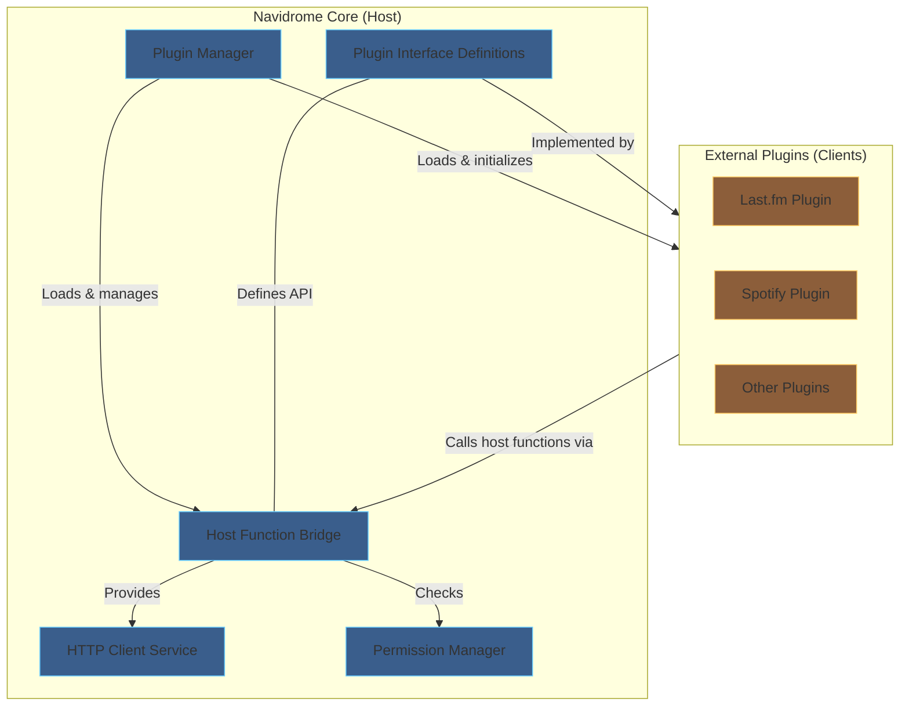
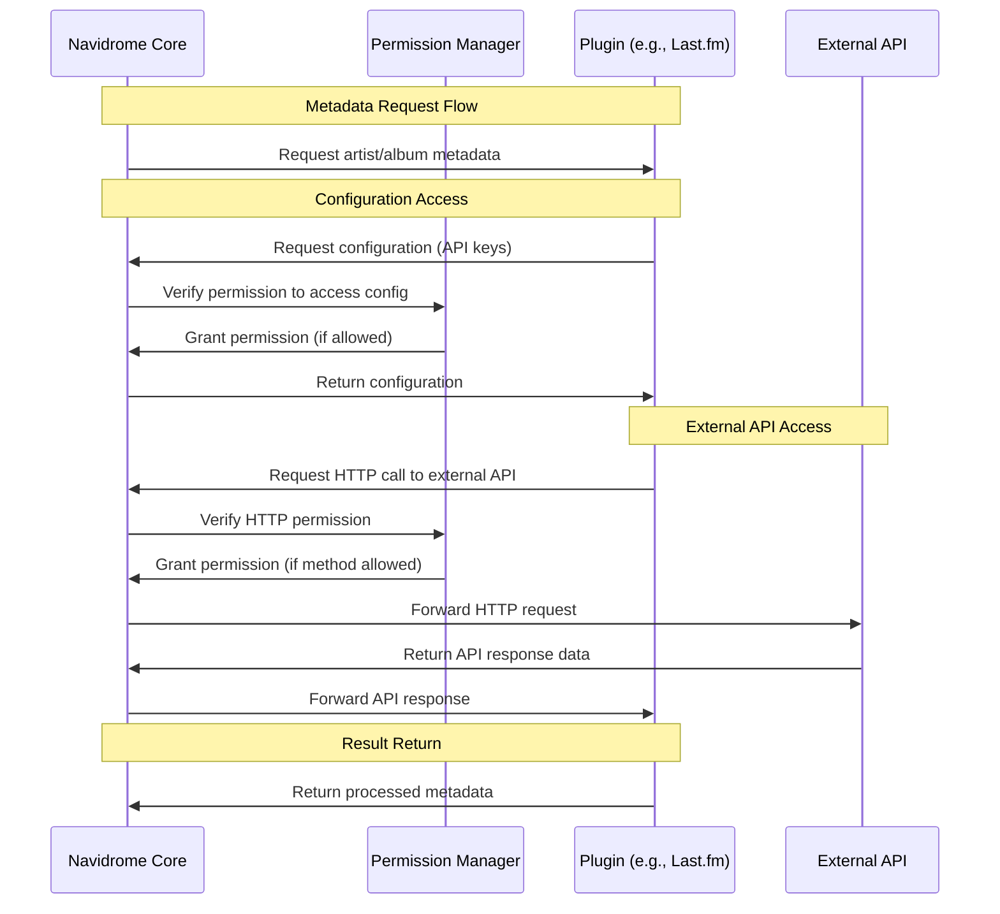
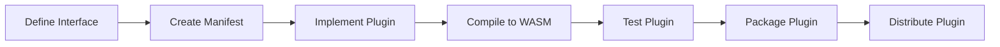

# High-Level Design: Navidrome Plugin System

## 1. Introduction

### 1.1 Purpose

This document describes the high-level design for implementing a plugin system in Navidrome. The plugin system will allow extending Navidrome's functionality without modifying the core codebase, starting with metadata agents as the first plugin type.

### 1.2 Scope

The initial implementation will focus on:

- Creating a plugin infrastructure based on WebAssembly using [knqyf263/go-plugin](https://github.com/knqyf263/go-plugin)
- Moving the Last.fm metadata agent to a plugin as proof of concept
- Providing a secure way for plugins to interact with Navidrome's configuration and user data

### 1.3 Definitions and Acronyms

- **Plugin**: An extension module loaded at runtime
- **WebAssembly/Wasm**: A binary instruction format that enables high-performance applications on web pages
- **Agent**: A component that retrieves metadata from external sources
- **Host Function**: A function provided by the host application that can be called by plugins
- **Plugin Manifest**: A JSON file that declares plugin capabilities, permissions, and configuration requirements

## 2. System Architecture

### 2.1 Architectural Overview

The plugin system follows a client-server architecture where Navidrome acts as the host (server) and plugins are clients that implement predefined interfaces.



### 2.2 Component Description

#### 2.2.1 Plugin Manager

The central component responsible for managing plugins. It handles:

- Discovery and loading of plugins
- Plugin lifecycle management
- Communication between plugins and core components
- Reading plugin manifests and registering capabilities

#### 2.2.2 Host Function Bridge

Provides access to Navidrome functionality for plugins, including:

- Configuration access
- User preferences
- Logging services
- HTTP client services (for external API calls)

#### 2.2.3 Plugin Interface Definitions

Defined using Protocol Buffers, these interfaces describe:

- Methods plugins must implement
- Data structures for communication
- Version information

#### 2.2.4 Agent Plugins

Implementations of metadata agents, starting with:

- Last.fm agent plugin (proof of concept)
- Future plugins for other metadata sources

#### 2.2.5 Permission Manager

Component that:

- Validates plugin permissions against configuration
- Enforces per-plugin restrictions on host functions
- Manages plugin-specific configurations

### 2.3 Data Flow

The following diagram illustrates the interaction between Navidrome Core and Plugins for a typical metadata request:



## 3. Technical Design

### 3.1 Protocol Buffer Definitions

The plugin system will define interfaces using Protocol Buffers:

```protobuf
// plugins/proto/agent.proto
syntax = "proto3";
package proto;

option go_package = "github.com/navidrome/navidrome/plugins/proto";

// go:plugin type=plugin version=1
service AgentPlugin {
  // GetArtistMBID retrieves the MusicBrainz ID for an artist
  rpc GetArtistMBID(GetArtistMBIDRequest) returns (GetArtistMBIDResponse) {}

  // GetArtistURL retrieves the URL for an artist
  rpc GetArtistURL(GetArtistURLRequest) returns (GetArtistURLResponse) {}

  // GetArtistBiography retrieves the biography for an artist
  rpc GetArtistBiography(GetArtistBiographyRequest) returns (GetArtistBiographyResponse) {}

  // GetSimilarArtists retrieves similar artists
  rpc GetSimilarArtists(GetSimilarArtistsRequest) returns (GetSimilarArtistsResponse) {}

  // GetArtistImages retrieves artist images
  rpc GetArtistImages(GetArtistImagesRequest) returns (GetArtistImagesResponse) {}

  // GetArtistTopSongs retrieves top songs for an artist
  rpc GetArtistTopSongs(GetArtistTopSongsRequest) returns (GetArtistTopSongsResponse) {}

  // GetAlbumInfo retrieves album information
  rpc GetAlbumInfo(GetAlbumInfoRequest) returns (GetAlbumInfoResponse) {}

  // GetAgentName returns the name of the agent
  rpc GetAgentName(GetAgentNameRequest) returns (GetAgentNameResponse) {}
}

// go:plugin type=host
service HostFunctions {
  // GetUserPreference retrieves a user preference
  rpc GetUserPreference(GetUserPreferenceRequest) returns (GetUserPreferenceResponse) {}

  // SetUserPreference sets a user preference
  rpc SetUserPreference(SetUserPreferenceRequest) returns (SetUserPreferenceResponse) {}

  // GetConfig retrieves the value of a configuration setting
  rpc GetConfig(GetConfigRequest) returns (GetConfigResponse) {}

  // Log allows plugins to log messages
  rpc Log(LogRequest) returns (LogResponse) {}

  // Generic HTTP function for external API calls
  rpc HttpDo(HttpDoRequest) returns (HttpDoResponse) {}
}

// HTTP message definitions
message HttpDoRequest {
  // HTTP method (GET, POST, PUT, DELETE, etc.)
  string method = 1;
  // URL to make the request to
  string url = 2;
  // HTTP headers
  map<string, string> headers = 3;
  // Request body (for POST, PUT, etc.)
  bytes body = 4;
  // Content type of the body
  string content_type = 5;
  // Timeout in seconds
  int32 timeout_seconds = 6;
}

message HttpDoResponse {
  // HTTP status code
  int32 status_code = 1;
  // Response headers
  map<string, string> headers = 2;
  // Response body
  bytes body = 3;
  // Error message if request failed
  string error = 4;
}
```

### 3.2 Plugin Manifest

Each plugin must include a manifest file (`manifest.json`) that declares its capabilities and required permissions:

```json
{
  "name": "lastfm",
  "version": "1.0.0",
  "description": "Last.fm metadata agent",
  "author": "Navidrome Team",
  "pluginType": "agent",
  "requiredPermissions": {
    "hostFunctions": ["HttpDo", "GetConfig", "Log", "GetUserPreference"],
    "allowedUrls": {
      "https://api.last.fm": ["GET", "POST"], // Specific URL with specific methods
      "https://ws.audioscrobbler.com": ["*"], // Any method on specific domain
      "https://*.last.fm": ["GET"], // GET requests to any last.fm subdomain
      "*": ["GET"] // GET requests to any URL (use with caution)
    },
    "allowRedirects": true
  },
  "configurationOptions": [
    { "name": "ApiKey", "required": true, "description": "Last.fm API key" },
    {
      "name": "Secret",
      "required": true,
      "description": "Last.fm API secret",
      "sensitive": true
    }
  ]
}
```

The manifest structure includes:

- Basic plugin metadata (name, version, description)
- Required permissions for host functions and HTTP methods
- Specific allowed URLs with permitted HTTP methods for each, supporting wildcards:
  - Exact URLs with specific methods
  - Domain-specific wildcards with `"*"` for any method
  - Domain pattern wildcards (e.g., `"https://*.domain.com"`)
  - Full wildcard `"*": ["*"]` for unrestricted access (should be used with caution)
- Whether redirects are allowed to be followed
- Configuration options the plugin needs to function

### 3.3 Plugin Manager Implementation

The Plugin Manager will be responsible for loading and managing plugins:

```go
// plugins/manager.go
package plugins

type Manager struct {
    ds             model.DataStore
    pluginsDir     string
    loadedPlugins  map[string]interface{}
    agentPlugins   map[string]*AgentPlugin
    permManager    *PermissionManager
    lock           sync.RWMutex
}

func (m *Manager) Initialize(ctx context.Context) error {
    // Initialize plugins directory and load available plugins
    // Read plugin manifests
    // Register with permission manager
}

func (m *Manager) GetAgentPlugin(name string) agents.Interface {
    // Return agent plugin by name if available
}

func (m *Manager) LoadPluginManifest(path string) (*PluginManifest, error) {
    // Read and parse manifest.json from plugin directory
}
```

### 3.4 Permission Manager Implementation

```go
// plugins/permission_manager.go
package plugins

type PermissionManager struct {
    config         *conf.Configuration
    pluginSettings map[string]conf.PluginOptions
}

func (p *PermissionManager) IsHostFunctionAllowed(pluginName, functionName string) bool {
    // Check if function is allowed for this plugin
}

func (p *PermissionManager) IsHttpMethodAllowed(pluginName, method string) bool {
    // Check if HTTP method is allowed for this plugin
}

func (p *PermissionManager) GetPluginConfig(pluginName string) map[string]interface{} {
    // Return plugin-specific configuration
}
```

### 3.5 Host Functions Implementation

Host functions provide plugins with access to Navidrome services:

```go
// plugins/host_functions.go
package plugins

type HostFunctions struct {
    ds             model.DataStore
    httpClient     *http.Client
    permManager    *PermissionManager
    pluginContext  *PluginContext // Holds current plugin name
}

func (h *HostFunctions) GetUserPreference(ctx context.Context, req proto.GetUserPreferenceRequest) (proto.GetUserPreferenceResponse, error) {
    // Check permission
    if !h.permManager.IsHostFunctionAllowed(h.pluginContext.Name, "GetUserPreference") {
        return proto.GetUserPreferenceResponse{}, errors.New("permission denied")
    }
    // Retrieve user preference from datastore
}

func (h *HostFunctions) GetConfig(ctx context.Context, req proto.GetConfigRequest) (proto.GetConfigResponse, error) {
    // Check permission
    if !h.permManager.IsHostFunctionAllowed(h.pluginContext.Name, "GetConfig") {
        return proto.GetConfigResponse{}, errors.New("permission denied")
    }
    // Retrieve configuration safely
}

func (h *HostFunctions) HttpDo(ctx context.Context, req proto.HttpDoRequest) (proto.HttpDoResponse, error) {
    // Check permission for HttpDo function
    if !h.permManager.IsHostFunctionAllowed(h.pluginContext.Name, "HttpDo") {
        return proto.HttpDoResponse{}, errors.New("permission denied")
    }

    // Extract the base URL for permission checking
    parsedURL, err := url.Parse(req.Url)
    if err != nil {
        return proto.HttpDoResponse{}, fmt.Errorf("invalid URL: %v", err)
    }

    // Block internal network addresses by default
    if isInternalAddress(parsedURL.Host) {
        return proto.HttpDoResponse{}, errors.New("access to internal network addresses is forbidden")
    }

    // Check if the URL is allowed for this plugin with the specific method
    baseURL := fmt.Sprintf("%s://%s", parsedURL.Scheme, parsedURL.Host)
    if !h.permManager.IsUrlAllowed(h.pluginContext.Name, baseURL, req.Method) {
        return proto.HttpDoResponse{}, fmt.Errorf("URL not allowed with method %s: %s", req.Method, baseURL)
    }

    // Configure redirect policy based on permissions
    client := *h.httpClient // Create a copy of the client to modify
    if !h.permManager.AreRedirectsAllowed(h.pluginContext.Name) {
        client.CheckRedirect = func(req *http.Request, via []*http.Request) error {
            return http.ErrUseLastResponse // Prevent following redirects
        }
    }

    // Create and send HTTP request based on the method and parameters provided
    // Return the response or error
}

// Helper function to detect internal network addresses
func isInternalAddress(host string) bool {
    // Remove port from host if present
    if idx := strings.LastIndex(host, ":"); idx != -1 {
        host = host[:idx]
    }

    // Check if IP address
    ip := net.ParseIP(host)
    if ip != nil {
        // Block private, loopback, and link-local addresses
        return ip.IsPrivate() || ip.IsLoopback() || ip.IsLinkLocalUnicast() || ip.IsLinkLocalMulticast()
    }

    // For hostnames, try to resolve and check IPs
    ips, err := net.LookupIP(host)
    if err != nil {
        // If we can't resolve, default to allowing it
        return false
    }

    for _, ip := range ips {
        if ip.IsPrivate() || ip.IsLoopback() || ip.IsLinkLocalUnicast() || ip.IsLinkLocalMulticast() {
            return true
        }
    }

    return false
}

// IsUrlAllowed checks if a URL and method are allowed for a plugin
func (p *PermissionManager) IsUrlAllowed(pluginName, requestURL, method string) bool {
    pluginSettings, ok := p.pluginSettings[pluginName]
    if !ok {
        return false
    }

    // Check for exact URL match first
    if methods, ok := pluginSettings.Limits.AllowedUrls[requestURL]; ok {
        return isMethodAllowed(methods, method)
    }

    // Check for wildcard domain matches
    for pattern, methods := range pluginSettings.Limits.AllowedUrls {
        if patternMatchesURL(pattern, requestURL) && isMethodAllowed(methods, method) {
            return true
        }
    }

    return false
}

// patternMatchesURL checks if a URL pattern matches a given URL
func patternMatchesURL(pattern, url string) bool {
    // Handle global wildcard
    if pattern == "*" {
        return true
    }

    // Handle domain wildcards like "https://*.example.com"
    if strings.Contains(pattern, "*") {
        regexp := strings.Replace(pattern, ".", "\\.", -1)
        regexp = strings.Replace(regexp, "*", ".*", -1)
        regexp = "^" + regexp + "$"
        match, err := regexp.MatchString(regexp, url)
        return err == nil && match
    }

    return false
}

// isMethodAllowed checks if a method is allowed in a list of methods
func isMethodAllowed(allowedMethods []string, method string) bool {
    for _, m := range allowedMethods {
        if m == method || m == "*" {
            return true
        }
    }
    return false
}
```

### 3.6 Configuration Structure

The configuration system will be enhanced to support per-plugin settings:

```go
// Global plugin settings
type GlobalPluginsOptions struct {
    Enabled       bool
    Directory     string
    DefaultLimits PluginLimits
}

// Limits and permissions that can be applied globally or per-plugin
type PluginLimits struct {
    AllowedHostFuncs    []string
    HttpTimeoutSeconds  int
    MaxHttpBodySizeMB   int
    AllowedUrls         map[string][]string  // Map of URLs to allowed methods
    AllowRedirects      bool
    RateLimits          map[string]int       // e.g., "requests_per_minute": 60
}

// Plugin-specific options
type PluginOptions struct {
    Enabled  bool
    Limits   PluginLimits
    Config   map[string]interface{} // Custom plugin configuration
}

// Updated configuration structure
type ServerConfig struct {
    // ...existing fields...

    // Global plugin settings
    Plugins GlobalPluginsOptions

    // Per-plugin settings
    PluginSettings map[string]PluginOptions
}
```

Example configuration in `navidrome.toml`:

```toml
[Plugins]
Enabled = true
Directory = "${DataFolder}/plugins"

[Plugins.DefaultLimits]
HttpTimeoutSeconds = 30
MaxHttpBodySizeMB = 10
AllowRedirects = false

[PluginSettings.lastfm]
Enabled = true
[PluginSettings.lastfm.Limits]
AllowedHostFuncs = ["HttpDo", "GetConfig", "Log", "GetUserPreference"]
AllowRedirects = true
[PluginSettings.lastfm.Limits.AllowedUrls]
"https://api.last.fm" = ["GET", "POST"]      # Specific URL with specific methods
"https://ws.audioscrobbler.com" = ["*"]      # Any method on specific domain
"https://*.last.fm" = ["GET"]                # GET requests to any last.fm subdomain
[PluginSettings.lastfm.Config]
ApiKey = "your_api_key_here"
Secret = "your_secret_here"

[PluginSettings.spotify]
Enabled = true
[PluginSettings.spotify.Limits]
AllowedHostFuncs = ["HttpDo", "Log"]
AllowRedirects = true
[PluginSettings.spotify.Limits.AllowedUrls]
"https://api.spotify.com" = ["GET"]          # Specific URL with specific method
[PluginSettings.spotify.Config]
ClientId = "your_client_id"
ClientSecret = "your_client_secret"

# Development plugin with unrestricted access - USE WITH CAUTION
[PluginSettings.devplugin]
Enabled = true
[PluginSettings.devplugin.Limits]
AllowedHostFuncs = ["HttpDo", "GetConfig", "Log", "GetUserPreference"]
AllowRedirects = true
[PluginSettings.devplugin.Limits.AllowedUrls]
"*" = ["*"]                                  # Unrestricted access to any URL with any method
```

## 4. Security Considerations

### 4.1 Plugin Sandbox

Plugins will run in a WebAssembly sandbox with limited capabilities:

- No direct file system access outside of designated paths
- No network access except through provided host functions
- No process spawning capabilities

### 4.2 Granular Permission Control

- Each plugin declares required permissions in its manifest
- Admin must explicitly configure and grant permissions
- Permissions are enforced at the host function level
- Different plugins can have different permission sets

### 4.3 Configuration Access Control

- Only a specific subset of configuration values will be exposed to plugins
- Configuration values will be provided through the plugin-specific settings
- Sensitive values like API keys can be limited to specific plugins

### 4.4 User Data Protection

- Plugins can only access user data through controlled interfaces
- Authentication and authorization are handled by the host
- Each plugin can be restricted from accessing user data if not needed

### 4.5 HTTP Security

- All HTTP requests from plugins are mediated through the unified HttpDo interface
- URLs are restricted to an explicit allowlist with specific HTTP methods allowed per URL
- Internal network addresses (private IP ranges, localhost) are explicitly blocked
- Redirects require explicit permission to prevent URL allowlist bypass
- URL validation prevents access to internal/restricted networks
- Rate limiting prevents abuse of external services
- Response size limits prevent memory exhaustion

## 5. Development and Deployment

### 5.1 Plugin Development Workflow



### 5.2 CLI Commands for Plugin Management

Navidrome will include CLI commands for plugin management:

```
navidrome plugin list              # List all installed plugins
navidrome plugin info [name]       # Show plugin information and manifest
navidrome plugin config-template [name]  # Generate config template for plugin
navidrome plugin install [file]    # Install a plugin from a .wasm file
navidrome plugin remove [name]     # Remove an installed plugin
navidrome plugin dev [folder_path] # Create symlink to development folder
navidrome plugin refresh [name]    # Reload plugin without restart
```

### 5.3 Plugin Installation Flow

1. Admin installs plugin file in the plugins directory
2. Navidrome detects new plugin on startup
3. Navidrome reads the plugin manifest and logs requirements
4. Admin runs `navidrome plugin info [name]` to view details
5. Admin runs `navidrome plugin config-template [name]` to get configuration template
6. Admin adds configuration to `navidrome.toml`
7. Navidrome loads plugin on next restart

### 5.4 Plugin Distribution and Packaging

Plugins will be distributed as `.ndp` (Navidrome Plugin) files, which are ZIP archives containing:

- `plugin.wasm` - The WebAssembly binary
- `manifest.json` - The plugin manifest
- Optional `README.md` - Documentation

This format simplifies distribution and installation while keeping all plugin files together.

**Creating a plugin package:**

```bash
# Create plugin package
zip myplugin.zip plugin.wasm manifest.json README.md
mv myplugin.zip myplugin.ndp
```

Distribution channels include:

- GitHub releases
- Navidrome plugin repository
- OCI registries

### 5.5 Plugin Development Workflow

For plugin developers, Navidrome provides additional commands to streamline the development process:

```
navidrome plugin dev [folder_path]     # Create symlink to development folder
navidrome plugin refresh [name]        # Reload plugin without restart
```

The `plugin dev` command creates a symlink to the development folder, allowing developers to work on plugin files directly without packaging. The folder should contain at minimum:

```
my-plugin/
├── plugin.wasm      # Compiled binary
├── manifest.json    # Plugin manifest
```

The `plugin refresh` command reloads a specific plugin without requiring a Navidrome restart, which enables rapid testing and iteration during development.

A typical development workflow:

1. Create plugin interface and manifest
2. Run `navidrome plugin dev ./my-plugin` to link development folder
3. Implement and compile plugin to WebAssembly
4. Run `navidrome plugin refresh my-plugin` to test changes
5. Repeat steps 3-4 until implementation is complete
6. Package as `.ndp` file for distribution

## 6. Implementation Plan
