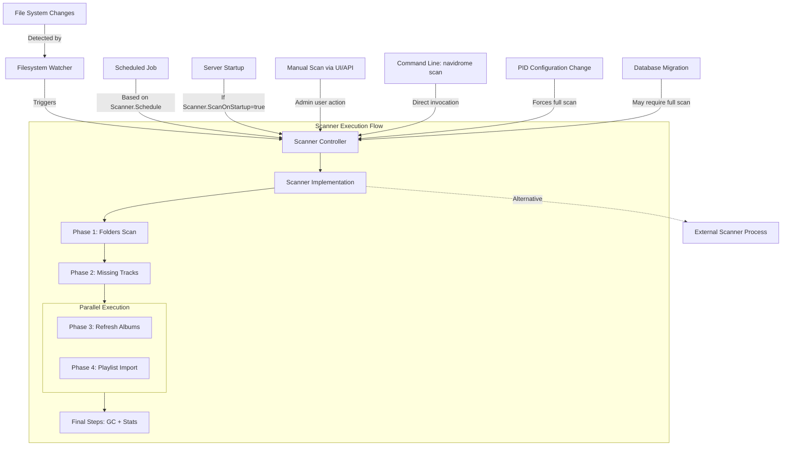
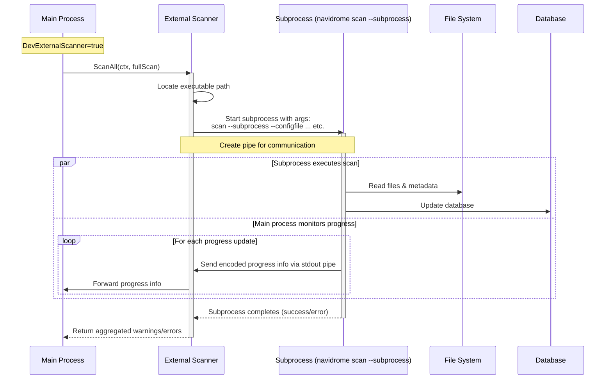
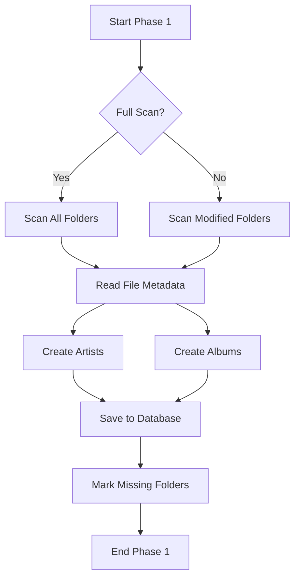
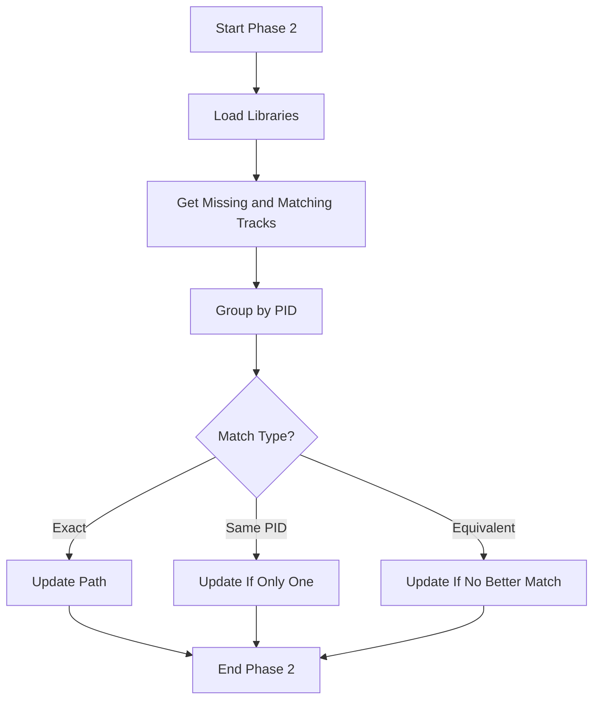
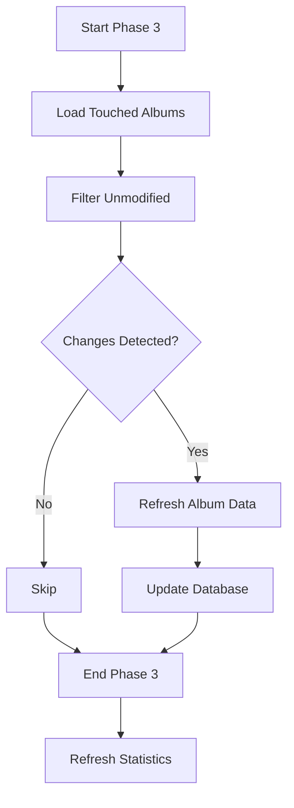
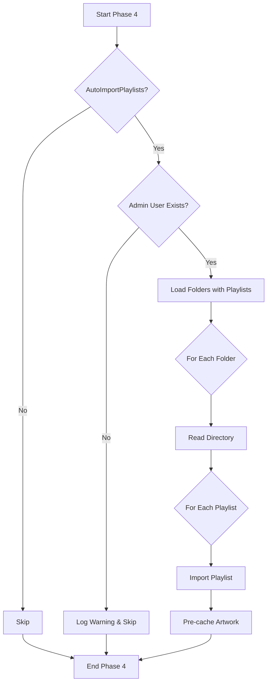
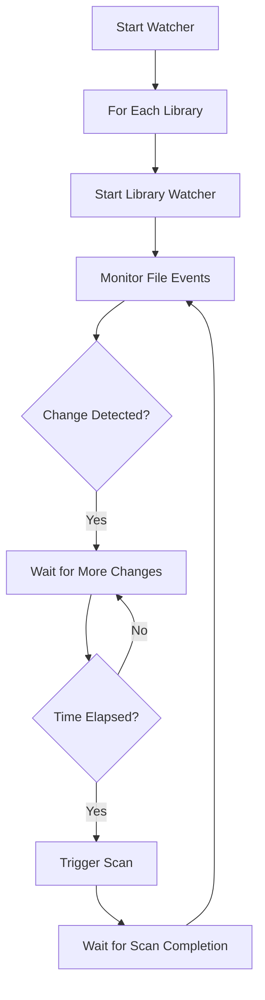

# Navidrome Scanner: Technical Overview

This document provides a comprehensive technical explanation of Navidrome's music library scanner system.

## Architecture Overview

The Navidrome scanner is built on a multi-phase pipeline architecture designed for efficient processing of music files. It systematically traverses file system directories, processes metadata, and maintains a database representation of the music library. A key performance feature is that some phases run sequentially while others execute in parallel.



The execution flow shows that Phases 1 and 2 run sequentially, while Phases 3 and 4 execute in parallel to maximize performance before the final processing steps.

## Core Components

### Scanner Controller (`controller.go`)

This is the entry point for all scanning operations. It provides:

- Public API for initiating scans and checking scan status
- Event broadcasting to notify clients about scan progress
- Serialization of scan operations (prevents concurrent scans)
- Progress tracking and monitoring
- Error collection and reporting

```go
type Scanner interface {
    // ScanAll starts a full scan of the music library. This is a blocking operation.
    ScanAll(ctx context.Context, fullScan bool) (warnings []string, err error)
    Status(context.Context) (*StatusInfo, error)
}
```

### Scanner Implementation (`scanner.go`)

The primary implementation that orchestrates the four-phase scanning pipeline. Each phase follows the Phase interface pattern:

```go
type phase[T any] interface {
    producer() ppl.Producer[T]
    stages() []ppl.Stage[T]
    finalize(error) error
    description() string
}
```

This design enables:
- Type-safe pipeline construction with generics
- Modular phase implementation
- Separation of concerns
- Easy measurement of performance

### External Scanner (`external.go`)

The External Scanner is a specialized implementation that offloads the scanning process to a separate subprocess. This is specifically designed to address memory management challenges in long-running Navidrome instances.

```go
// scannerExternal is a scanner that runs an external process to do the scanning. It is used to avoid
// memory leaks or retention in the main process, as the scanner can consume a lot of memory. The
// external process will be spawned with the same executable as the current process, and will run
// the "scan" command with the "--subprocess" flag.
//
// The external process will send progress updates to the main process through its STDOUT, and the main
// process will forward them to the caller.
```



Technical details:

1. **Process Isolation**
    - Spawns a separate process using the same executable
    - Uses the `--subprocess` flag to indicate it's running as a child process
    - Preserves configuration by passing required flags (`--configfile`, `--datafolder`, etc.)

2. **Inter-Process Communication**
    - Uses a pipe for bidirectional communication
    - Encodes/decodes progress updates using Go's `gob` encoding for efficient binary transfer
    - Properly handles process termination and error propagation

3. **Memory Management Benefits**
    - Scanning operations can be memory-intensive, especially with large music libraries
    - Memory leaks or excessive allocations are automatically cleaned up when the process terminates
    - Main Navidrome process remains stable even if scanner encounters memory-related issues

4. **Error Handling**
    - Detects non-zero exit codes from the subprocess
    - Propagates error messages back to the main process
    - Ensures resources are properly cleaned up, even in error conditions

## Scanning Process Flow

### Phase 1: Folder Scan (`phase_1_folders.go`)

This phase handles the initial traversal and media file processing.



**Technical implementation details:**

1. **Folder Traversal**
    - Uses `walkDirTree` to traverse the directory structure
    - Handles symbolic links and hidden files
    - Processes `.ndignore` files for exclusions
    - Maps files to appropriate types (audio, image, playlist)

2. **Metadata Extraction**
    - Processes files in batches (defined by `filesBatchSize = 200`)
    - Extracts metadata using the configured storage backend
    - Converts raw metadata to `MediaFile` objects
    - Collects and normalizes tag information

3. **Album and Artist Creation**
    - Groups tracks by album ID
    - Creates album records from track metadata
    - Handles album ID changes by tracking previous IDs
    - Creates artist records from track participants

4. **Database Persistence**
    - Uses transactions for atomic updates
    - Preserves album annotations across ID changes
    - Updates library-artist mappings
    - Marks missing tracks for later processing
    - Pre-caches artwork for performance

### Phase 2: Missing Tracks Processing (`phase_2_missing_tracks.go`)

This phase identifies tracks that have moved or been deleted.



**Technical implementation details:**

1. **Track Identification Strategy**
    - Uses persistent identifiers (PIDs) to track tracks across scans
    - Loads missing tracks and potential matches from the database
    - Groups tracks by PID to limit comparison scope

2. **Match Analysis**
    - Applies three levels of matching criteria:
        - Exact match (full metadata equivalence)
        - Single match for a PID
        - Equivalent match (same base path or similar metadata)
    - Prioritizes matches in order of confidence

3. **Database Update Strategy**
    - Preserves the original track ID
    - Updates the path to the new location
    - Deletes the duplicate entry
    - Uses transactions to ensure atomicity

### Phase 3: Album Refresh (`phase_3_refresh_albums.go`)

This phase updates album information based on the latest track metadata.



**Technical implementation details:**

1. **Album Selection Logic**
    - Loads albums that have been "touched" in previous phases
    - Uses a producer-consumer pattern for efficient processing
    - Retrieves all media files for each album for completeness

2. **Change Detection**
    - Rebuilds album metadata from associated tracks
    - Compares album attributes for changes
    - Skips albums with no media files
    - Avoids unnecessary database updates

3. **Statistics Refreshing**
    - Updates album play counts
    - Updates artist play counts
    - Maintains consistency between related entities

### Phase 4: Playlist Import (`phase_4_playlists.go`)

This phase imports and updates playlists from the file system.



**Technical implementation details:**

1. **Playlist Discovery**
    - Loads folders known to contain playlists
    - Focuses on folders that have been touched in previous phases
    - Handles both playlist formats (M3U, NSP)

2. **Import Process**
    - Uses the core.Playlists service for import
    - Handles both regular and smart playlists
    - Updates existing playlists when changed
    - Pre-caches playlist cover art

3. **Configuration Awareness**
    - Respects the AutoImportPlaylists setting
    - Requires an admin user for playlist import
    - Logs appropriate messages for configuration issues

## Final Processing Steps

After the four main phases, several finalization steps occur:

1. **Garbage Collection**
    - Removes dangling tracks with no files
    - Cleans up empty albums
    - Removes orphaned artists
    - Deletes orphaned annotations

2. **Statistics Refresh**
    - Updates artist song and album counts
    - Refreshes tag usage statistics
    - Updates aggregate metrics

3. **Library Status Update**
    - Marks scan as completed
    - Updates last scan timestamp
    - Stores persistent ID configuration

4. **Database Optimization**
    - Performs database maintenance
    - Optimizes tables and indexes
    - Reclaims space from deleted records

## File System Watching

The watcher system (`watcher.go`) provides real-time monitoring of file system changes:



**Technical implementation details:**

1. **Event Throttling**
    - Uses a timer to batch changes
    - Prevents excessive rescanning
    - Configurable wait period

2. **Library-specific Watching**
    - Each library has its own watcher goroutine
    - Translates paths to library-relative paths
    - Filters irrelevant changes

3. **Platform Adaptability**
    - Uses storage-provided watcher implementation
    - Supports different notification mechanisms per platform
    - Graceful fallback when watching is not supported

## Edge Cases and Optimizations

### Handling Album ID Changes

The scanner carefully manages album identity across scans:
- Tracks previous album IDs to handle ID generation changes
- Preserves annotations when IDs change
- Maintains creation timestamps for consistent sorting

### Detecting Moved Files

A sophisticated algorithm identifies moved files:
1. Groups missing and new files by their Persistent ID
2. Applies multiple matching strategies in priority order
3. Updates paths rather than creating duplicate entries

### Resuming Interrupted Scans

If a scan is interrupted:
- The next scan detects this condition
- Forces a full scan if the previous one was a full scan
- Continues from where it left off for incremental scans

### Memory Efficiency

Several strategies minimize memory usage:
- Batched file processing (200 files at a time)
- External scanner process option
- Database-side filtering where possible
- Stream processing with pipelines

### Concurrency Control

The scanner implements a sophisticated concurrency model to optimize performance:

1. **Phase-Level Parallelism**:
    - Phases 1 and 2 run sequentially due to their dependencies
    - Phases 3 and 4 run in parallel using the `chain.RunParallel()` function
    - Final steps run sequentially to ensure data consistency

2. **Within-Phase Concurrency**:
    - Each phase has configurable concurrency for its stages
    - For example, `phase_1_folders.go` processes folders concurrently: `ppl.NewStage(p.processFolder, ppl.Name("process folder"), ppl.Concurrency(conf.Server.DevScannerThreads))`
    - Multiple stages can exist within a phase, each with its own concurrency level

3. **Pipeline Architecture Benefits**:
    - Producer-consumer pattern minimizes memory usage
    - Work is streamed through stages rather than accumulated
    - Back-pressure is automatically managed

4. **Thread Safety Mechanisms**:
    - Atomic counters for statistics gathering
    - Mutex protection for shared resources
    - Transactional database operations

## Configuration Options

The scanner's behavior can be customized through several configuration settings that directly affect its operation:

### Core Scanner Options

| Setting                 | Description                                                      | Default        | 
|-------------------------|------------------------------------------------------------------|----------------|
| `Scanner.Enabled`       | Whether the automatic scanner is enabled                         | true           |
| `Scanner.Schedule`      | Cron expression or duration for scheduled scans (e.g., "@daily") | "0" (disabled) |
| `Scanner.ScanOnStartup` | Whether to scan when the server starts                           | true           |
| `Scanner.WatcherWait`   | Delay before triggering scan after file changes detected         | 5s             |
| `Scanner.ArtistJoiner`  | String used to join multiple artists in track metadata           | " • "          |

### Playlist Processing

| Setting                     | Description                                              | Default |
|-----------------------------|----------------------------------------------------------|---------|
| `PlaylistsPath`             | Path(s) to search for playlists (supports glob patterns) | ""      |
| `AutoImportPlaylists`       | Whether to import playlists during scanning              | true    |

### Performance Options

| Setting              | Description                                               | Default |
|----------------------|-----------------------------------------------------------|---------|
| `DevExternalScanner` | Use external process for scanning (reduces memory issues) | true    |
| `DevScannerThreads`  | Number of concurrent processing threads during scanning   | 5       |

### Persistent ID Options

| Setting     | Description                                                         | Default                                                             |
|-------------|---------------------------------------------------------------------|---------------------------------------------------------------------|
| `PID.Track` | Format for track persistent IDs (critical for tracking moved files) | "musicbrainz_trackid\|albumid,discnumber,tracknumber,title"         |
| `PID.Album` | Format for album persistent IDs (affects album grouping)            | "musicbrainz_albumid\|albumartistid,album,albumversion,releasedate" |

These options can be set in the Navidrome configuration file (e.g., `navidrome.toml`) or via environment variables with the `ND_` prefix (e.g., `ND_SCANNER_ENABLED=false`). For environment variables, dots in option names are replaced with underscores.

## Conclusion

The Navidrome scanner represents a sophisticated system for efficiently managing music libraries. Its phase-based pipeline architecture, careful handling of edge cases, and performance optimizations allow it to handle libraries of significant size while maintaining data integrity and providing a responsive user experience.